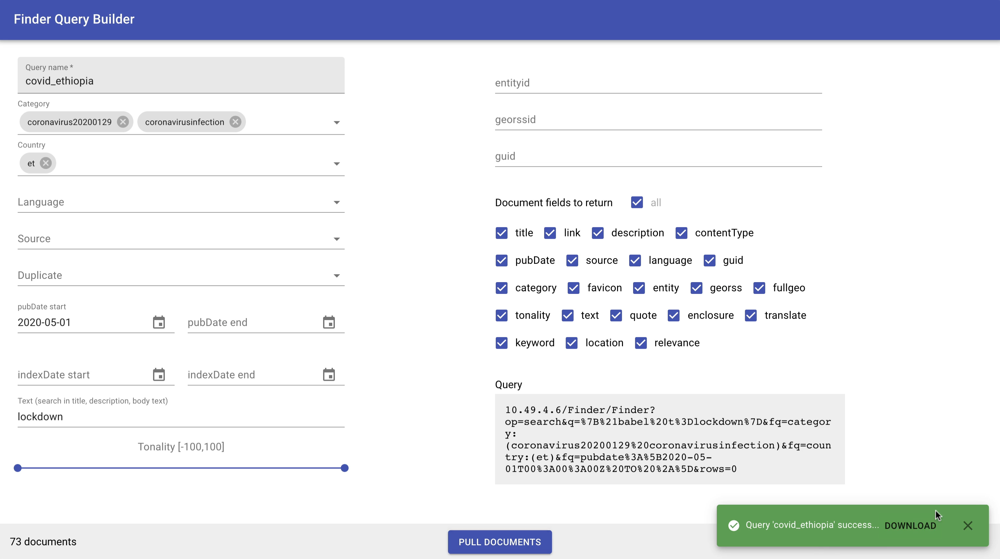

```{r, include = FALSE}
knitr::opts_chunk$set(
  collapse = TRUE,
  comment = "#>"
)
```

This codebase contains code that exposes a REST API and web interface for building queries.

The REST API is built using [Plumber](https://www.rplumber.io).

The web app is written using [React](https://reactjs.org) and calls the API to build the query and download the documents.



Note that "multiselect" text fields in the application are pre-populated with all of the unique values found in the data as of March 2021. In theory we could expose API endpoints that always get the latest values, but this would slow down the initial app load considerably. Instead, we can update these values every few days/weeks/months or on demand.

To make updating the values more convenient, [an R script](https://github.com/hafen/finderquery/blob/master/app/generate_options.R) is available that can be run that uses the finderquery R package to get all of the valid values and overwrite them to the [options.js](https://github.com/hafen/finderquery/blob/master/app/src/options.js) file that is used by the application.
